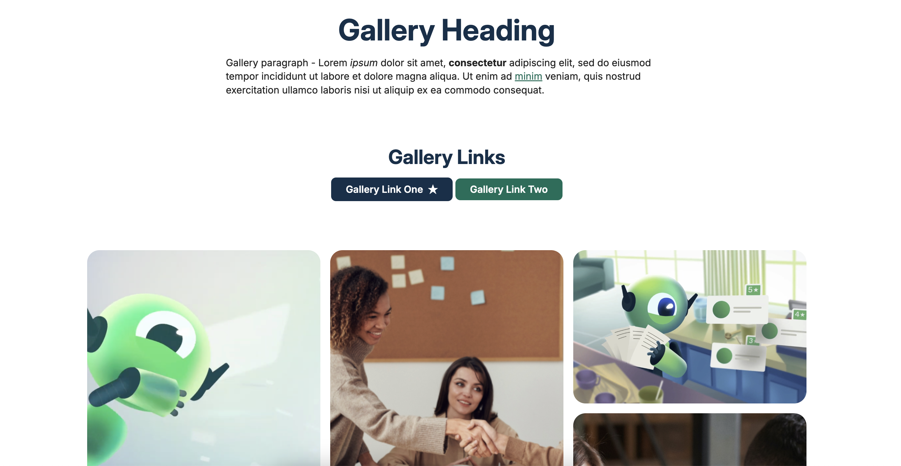

# Gallery Content Component

Responsive gallery component with interactive YouTube video modal, built as a take-home task for the Web Developer role at SmartRecruiters.

## Preview



## Tech Stack

- **HTML5** — Semantic markup
- **SCSS** — BEM naming convention
- **TypeScript** — Interactive functionality
- **Jest** — Unit testing
- **Inter** — Typography via Google Fonts

> No JS or CSS frameworks were used.

## Getting Started

### Prerequisites

- Node.js v18+
- npm

### Installation

```bash
git clone https://github.com/Michaellinaresxk/SmartRecruiters-Test.git
cd SmartRecruiters-Test
npm install
```

### Development

Run in separate terminals:

```bash
npm run watch:css
npm run watch:ts
```

Then open `index.html` with a live server.

### Build

```bash
npm run build:css
npm run build:ts
```

### Tests

```bash
npm run test
```

## Scripts

| Command | Description |
| `npm run build:css` | Compile SCSS to CSS |
| `npm run build:ts` | Compile TypeScript to JS |
| `npm run watch:css` | Watch and compile SCSS on save |
| `npm run watch:ts` | Watch and compile TS on save |
| `npm run test` | Run Jest unit tests |
| `npm run test:watch` | Run tests in watch mode |

## Accessibility

- Semantic HTML (`<dialog>`, `<figure>`, `<button>`)
- ARIA attributes (`aria-label`, `aria-hidden`)
- Keyboard navigation — Tab, Enter, Escape
- Focus trap within modal
- Descriptive alt text on all images

## References

- [Figma Design](https://www.figma.com/design/V6vjx6d5Nw3WiXT60c8u4F/)
- [Inter Font](https://fonts.google.com/specimen/Inter)